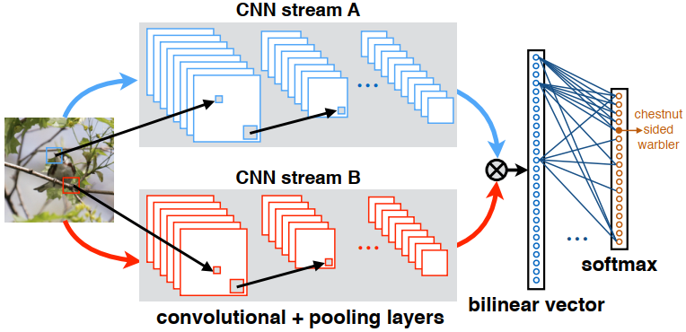

# Bilinear-CNN
A pytorch implementation of bilinear CNN for fine-grained image recognition in paper [Bilinear CNNs for Fine-grained Visual
Recognition](https://arxiv.org/pdf/1504.07889.pdf) by Tsung-Yu Lin, Aruni RoyChowdhury, Subhransu Maji.  
The framework of the entire model is shown in the figure below:

## Dependencies ##  
python >= 3.5  
pytorch >= 0.4  
In addition, please add the project folder to PYTHONPATH and `pip install` the following packages:  
- `tqdm`  

## Data ##  
Download the [CUB_birds](http://www.vision.caltech.edu/visipedia/CUB-200-2011.html) images and annotations. Extract them to `data/raw/`  

## Training ##
